# 🚀 FinTrack Deployment Playbook

## Overview

This playbook covers the complete deployment workflow from feature development to production release, including automation strategies and manual processes.

## 🔄 Deployment Workflow

```mermaid
graph TD
    A[Feature Branch] --> B[Create PR to Release Branch]
    B --> C[Code Review & Approval]
    C --> D[Merge to Release Branch]
    D --> E[🤖 Auto-Deploy to Staging]
    E --> F[QA Testing on Staging]
    F --> G{QA Pass?}
    G -->|No| H[Fix Issues in Feature Branch]
    H --> B
    G -->|Yes| I[Create PR: Release → Main]
    I --> J[Final Review & Approval]
    J --> K[Merge to Main]
    K --> L[🤖 Auto-Deploy to Production]
    L --> M[Post-Deployment Verification]
```



## 📋 Phase 1: Feature to Release Branch

### 1.1 Prepare Feature Branch
```bash
# Ensure feature branch is up to date
git checkout feature/your-feature-name
git pull origin feature/your-feature-name

# Run pre-merge checks
npm run build
npm run test
npm run lint
```

### 1.2 Create Pull Request to Release Branch
- **Target**: `release/vX.Y` (e.g., `release/v5.1`)
- **Source**: `feature/your-feature-name`
- **Required Checks**:
  - ✅ All tests pass
  - ✅ Build succeeds
  - ✅ No ESLint errors
  - ✅ Date handling compliance
  - ✅ Security audit clean
  - ✅ No mock data in production code

### 1.3 Code Review Process
- **Reviewers**: At least 1 team member
- **Focus Areas**:
  - Code quality and standards
  - Security considerations
  - Performance impact
  - Database migration safety
  - Documentation completeness

### 1.4 Merge to Release Branch
```bash
# After PR approval
git checkout release/v5.1
git pull origin release/v5.1
# Merge happens via GitHub PR interface
```

## 🤖 Phase 2: Automated Staging Deployment

### 2.1 Trigger (Recommended: Automated)
**When**: Merge to release branch
**How**: GitHub Actions workflow

```yaml
# .github/workflows/staging-deploy.yml
name: Deploy to Staging
on:
  push:
    branches: [release/*]
jobs:
  deploy-staging:
    runs-on: ubuntu-latest
    steps:
      - uses: actions/checkout@v3
      - name: Deploy to Vercel Staging
        run: vercel --prod=false --token=${{ secrets.VERCEL_TOKEN }}
      - name: Update Deployment Docs
        run: |
          # Update docs/deployment-tracking/staging.md
          # Commit and push changes
```

### 2.2 Manual Alternative (Current Process)
```bash
# If automation not yet set up
git checkout release/v5.1
vercel --prod=false
# Update docs/deployment-tracking/staging.md
```

### 2.3 Post-Deployment Actions
- ✅ Update `docs/deployment-tracking/staging.md`
- ✅ Update `docs/deployment-tracking/DEPLOYMENT_STATUS.md`
- ✅ Notify QA team
- ✅ Run smoke tests

## 🧪 Phase 3: QA Testing on Staging

### 3.1 QA Checklist
- **Environment**: Staging URL from deployment docs
- **Test Cases**: Use release-specific QA guide (e.g., `docs/releases/v5.1/QA_TESTING_GUIDE.md`)
- **Focus Areas**:
  - New feature functionality
  - Regression testing
  - Performance validation
  - Mobile responsiveness
  - Cross-browser compatibility

### 3.2 Issue Resolution Process
```bash
# If issues found
git checkout feature/your-feature-name
# Fix issues
git add .
git commit -m "fix: resolve QA feedback"
git push origin feature/your-feature-name
# Update existing PR to release branch
```

### 3.3 QA Sign-off
- ✅ All test cases pass
- ✅ No critical bugs
- ✅ Performance acceptable
- ✅ Documentation updated
- ✅ QA team approval

## 🎯 Phase 4: Release to Main Branch

### 4.1 Create Production PR
- **Target**: `main`
- **Source**: `release/vX.Y`
- **Title**: `Release v5.1.0 to Production`
- **Description**: Include:
  - Feature summary
  - QA sign-off confirmation
  - Breaking changes (if any)
  - Migration steps (if any)

### 4.2 Final Review Process
- **Reviewers**: Senior team members + Tech Lead
- **Focus Areas**:
  - Production readiness
  - Database migrations
  - Environment variables
  - Monitoring setup
  - Rollback plan

### 4.3 Pre-Production Checklist
```bash
# Run comprehensive checks
npm run build
npm run test:coverage
npm run lint
npm run type-check
npm audit
```

## 🚀 Phase 5: Production Deployment

### 5.1 Merge to Main
```bash
# After final approval
git checkout main
git pull origin main
# Merge happens via GitHub PR interface
```

### 5.2 Production Deployment (Recommended: Automated)
```yaml
# .github/workflows/production-deploy.yml
name: Deploy to Production
on:
  push:
    branches: [main]
jobs:
  deploy-production:
    runs-on: ubuntu-latest
    steps:
      - uses: actions/checkout@v3
      - name: Deploy to Vercel Production
        run: vercel --prod --token=${{ secrets.VERCEL_TOKEN }}
      - name: Create Git Tag
        run: |
          git tag v5.1.0
          git push origin v5.1.0
```

### 5.3 Manual Production Deployment
```bash
# If automation not set up
git checkout main
git pull origin main
vercel --prod

# Create release tag
git tag v5.1.0
git push origin v5.1.0
```

## 📊 Phase 6: Post-Deployment Verification

### 6.1 Immediate Checks (0-15 minutes)
- ✅ Health check endpoint: `/api/health`
- ✅ Critical user flows work
- ✅ Database connectivity
- ✅ Authentication system
- ✅ Key features functional

### 6.2 Extended Monitoring (15 minutes - 2 hours)
- ✅ Error rates normal
- ✅ Response times acceptable
- ✅ No memory leaks
- ✅ Database performance stable
- ✅ User feedback positive

### 6.3 Documentation Updates
- ✅ Update `docs/deployment-tracking/production.md`
- ✅ Update `docs/deployment-tracking/DEPLOYMENT_STATUS.md`
- ✅ Create release notes
- ✅ Update changelog

## 🔧 Automation Recommendations

### Staging Deployment Automation
**✅ RECOMMENDED**: Automate staging deployment on release branch merge

**Benefits**:
- Faster feedback loop
- Consistent deployment process
- Reduced manual errors
- Immediate QA availability

**Implementation**:
```yaml
# Trigger on release branch push
on:
  push:
    branches: [release/*]
```

### Production Deployment Automation
**⚠️ CONDITIONAL**: Automate only after staging automation is stable

**Benefits**:
- Faster releases
- Consistent process
- Reduced deployment friction

**Safeguards**:
- Require manual approval gate
- Comprehensive pre-deployment checks
- Automatic rollback on failure

## 🚨 Emergency Procedures

### Hotfix Process
```bash
# Create hotfix branch from main
git checkout main
git checkout -b hotfix/critical-fix

# Make minimal fix
# Test thoroughly
# Create PR directly to main
# Deploy immediately after merge
```

### Rollback Process
```bash
# Quick rollback via Vercel
vercel rollback [deployment-url]

# Or redeploy previous version
git checkout v5.0.1  # Previous stable tag
vercel --prod
```

## 📝 Branch Strategy Summary

| Branch Type | Purpose | Deploys To | Automation |
|-------------|---------|------------|------------|
| `feature/*` | Development | None | Manual testing |
| `release/*` | Integration | Staging | ✅ Automated |
| `main` | Production | Production | ✅ Automated (with gates) |
| `hotfix/*` | Emergency fixes | Production | Manual (fast-track) |

## 🎯 Next Steps for Full Automation

1. **Set up GitHub Actions** for staging deployment
2. **Configure Vercel integration** with GitHub
3. **Add deployment status checks** to PRs
4. **Set up monitoring alerts** for deployments
5. **Create rollback automation** for failed deployments
6. **Add deployment notifications** to team channels

---

*This playbook should be updated as the deployment process evolves and automation is implemented.*
