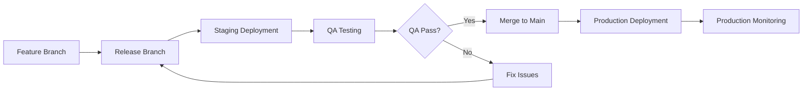

# 🚀 Deployment Status Overview

*Last Updated: January 18, 2025*

## 📊 Current Environment Status

| Environment | Version | Status | Platform | Database | Last Updated |
|-------------|---------|--------|----------|----------|--------------|
| **Staging** | v5.1.0 | ✅ Active | Vercel | Staging DB | Jan 18, 2025 |
| **Production** | None | 🚫 Not Deployed | TBD | Not Setup | N/A |

## 🎯 Next Steps

### Immediate Actions Needed
1. **Production Environment Setup**
   - [ ] Configure production Vercel project
   - [ ] Set up production database
   - [ ] Configure environment variables and secrets
   - [ ] Set up domain and SSL certificates

2. **First Production Release Planning**
   - [ ] Decide on first production version (v5.0.1 or v5.1.0)
   - [ ] Complete staging QA for chosen version
   - [ ] Prepare production deployment checklist
   - [ ] Schedule production deployment window

### Development Pipeline
- **Feature Branch**: `feature/v5.0.3-csv-import` (CSV Import + Enhancements)
- **Release Branch**: `release/v5.1` (Preparing for next staging deployment)
- **Main Branch**: Ready for production (currently v5.0.1 equivalent)

## 🔄 Deployment Workflow

## 📋 Environment Details

### Staging Environment
- **Purpose**: QA testing, feature validation, integration testing
- **Current Version**: v5.0.1
- **Features**: Core FinTrack functionality
- **Access**: Development team, QA team
- **Data**: Test data, safe for experimentation

### Production Environment (Planned)
- **Purpose**: Live user-facing application
- **Target Version**: TBD (v5.0.1 or v5.1.0)
- **Features**: Stable, thoroughly tested features only
- **Access**: End users, limited admin access
- **Data**: Real user data, requires backup and security measures

## 🚨 Emergency Procedures

### Staging Issues
- **Contact**: Development team
- **Rollback**: Available to previous version
- **Impact**: Development and QA workflow only

### Production Issues (When Live)
- **Contact**: On-call engineer, DevOps team
- **Rollback**: Immediate rollback procedures available
- **Impact**: User-facing, requires immediate attention

## 📞 Contact Information

- **Development Team**: [Team contact]
- **DevOps/Infrastructure**: [DevOps contact]
- **QA Team**: [QA contact]
- **Emergency Escalation**: [Emergency contact]

---

## 📚 Related Documentation

- **[Staging Environment Details](./staging.md)** - Detailed staging deployment history
- **[Production Environment Details](./production.md)** - Production setup and procedures
- **[Deployment Guides](../deployment-guides/README.md)** - How-to guides for deployment
- **[Feature Backlog](../FEATURE_BACKLOG.md)** - Planned features and priorities

---

*For detailed environment information, see individual environment files. For deployment procedures, see the deployment-guides directory.*
